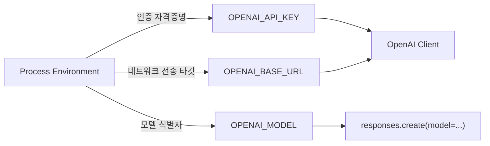

# 0. 환경 구축: 실행 환경과 Provider 구성

실습 코드를 실행하기 전에 **어떤 도구로 실행하며, 로컬 환경변수와 네트워크 엔드포인트가 어떻게 연결되는지** 준비한다.

---

## 0.1 실행 도구: Python과 `uv`

이 deck의 모든 실습 코드는 **PEP 723(Inline script metadata)** 형식을 따른다. 각 스크립트 상단에 필요한
의존성(`openai>=3,<4`, `pydantic>=2` 등)이 선언되어 있다.

```python
# /// script
# requires-python = ">=3.10"
# dependencies = [
#   "openai>=3,<4",
# ]
# ///
```

따라서 별도로 가상환경을 수동 생성하고 패키지를 설치할 필요 없이, `uv run` 명령으로 실행한다.

```bash
# uv를 통한 격리 실행 (의존성을 임시 격리 환경에 자동 준비)
uv run decks/ai-openai_sdk/playground/request_response.py --preview
```

- **`uv`가 설치되어 있는 경우**: `uv run <스크립트경로>`로 실행하면 스크립트별 메타데이터에 맞는 의존성을 즉시 격리
  실행한다.
- **Python 기본 실행**: `--preview` 모드는 외부 SDK(`openai`)를 임포트하기 전 단계이므로 `python3`만으로도 실행할 수
  있다.

---

## 0.2 엔드포인트 선택: 로컬 Ollama vs 공식 OpenAI API

OpenAI Python SDK는 공식 클라우드 서비스에만 종속된 도구가 아니다. **OpenAI 호환 규격을 제공하는 로컬 모델 서버(Ollama
등)**와도 완벽히 동일한 방식으로 통신할 수 있다.

학습 상황에 맞춰 다음 두 가지 경로 중 하나를 선택한다.

### 경로 A: 로컬 Ollama 환경 (무과금 / 프라이빗 / 오프라인)

로컬 머신에 [Ollama](https://ollama.ai)가 설치되어 있고 백그라운드에서 실행 중인 경우 사용한다. API 요금이 발생하지
않으며 네트워크 연결 없이 실습할 수 있다.

1. **로컬 모델 준비** (터미널에서 원하는 모델 pull):

   ```bash
   ollama pull nemotron-3-nano:4b
   # 또는 ollama pull llama3.2
   ```

2. **환경 변수 설정**:

   ```bash
   export OPENAI_BASE_URL="http://localhost:11434/v1"
   export OPENAI_API_KEY="ollama"             # Ollama는 키가 필요 없지만 SDK 검증 통과를 위해 더미 문자열 지정
   export OPENAI_MODEL="nemotron-3-nano:4b"  # pull받은 로컬 모델명 지정
   ```

### 경로 B: 공식 OpenAI API (클라우드 서비스)

실제 OpenAI 플랫폼의 모델(`gpt-5.6-luna`, `gpt-4o` 등)과 통신하는 표준 경로다. 유료 API 키와 사용량 크레딧이 필요하다.

1. **환경 변수 설정**:

   ```bash
   export OPENAI_API_KEY="sk-..."
   # OPENAI_BASE_URL은 별도로 설정하지 않음 (기본값 https://api.openai.com/v1 적용)
   # OPENAI_MODEL은 필요 시 override (미지정 시 덱 기본 모델 사용)
   ```

---

## 0.3 환경 변수 3요소의 책임과 소유권

SDK 클라이언트를 생성할 때 `client = OpenAI()`는 시스템 환경 변수를 자동으로 읽는다. 이때 관여하는 세 환경 변수는 명확히
다른 책임을 갖는다.



| 환경 변수 | 소유 주체 | 역할 및 주의사항 |
| :--- | :--- | :--- |
| `OPENAI_API_KEY` | 실행 프로세스 | **인증 자격증명**. 코드에 `api_key="sk-..."` 형태로 하드코딩해서는 안 된다. 소스코드가 시크릿을 소유하지 않고 환경이 주입해야 한다. |
| `OPENAI_BASE_URL` | 실행 프로세스 | **네트워크 대상 엔드포인트**. 로컬 Ollama(`http://localhost:11434/v1`)나 내부 프록시 등으로 전송 대상을 바꿀 때 사용한다. |
| `OPENAI_MODEL` | 애플리케이션 / 프로세스 | **대상 모델 식별자**. 모델 카탈로그는 버전에 민감하므로 하드코딩 대신 환경이나 설정으로 제어한다. |

---

## 0.4 안전한 실습: `--preview` 모드

모든 playground 스크립트는 `--preview` 플래그를 지원한다.

```bash
python3 decks/ai-openai_sdk/playground/request_response.py --preview
```

`--preview` 모드의 핵심 특징:

1. `openai` 라이브러리를 임포트조차 하지 않는다.
2. 네트워크 요청을 일절 보내지 않는다.
3. API 키가 없어도 100% 정상 실행된다.
4. **내 애플리케이션이 구성한 인자(`call_args`)가 올바른 형태인지 로컬에서 먼저 검증**할 수 있다.

따라서 새로운 실습을 진행할 때는 항상 `--preview`로 애플리케이션의 의도를 먼저 확인한 뒤, 실제 라이브 호출로 넘어가는
것이 안전한 실습 원칙이다.

---

## 0.5 환경 점검 (Preflight Check)

환경 구성이 완료되었는지 확인하기 위해 다음 명령을 실행해 본다.

```bash
# 1. Preview 실행 검증 (네트워크 무관)
python3 decks/ai-openai_sdk/playground/request_response.py --preview

# 2. Live 실행 검증 (환경 변수에 지정된 엔드포인트로 실제 호출)
uv run decks/ai-openai_sdk/playground/request_response.py
```

`== selected response fields ==` 아래에 `python_type: Response`와 `output_text`가 정상 출력된다면 환경 구축이 완료된
것이다.

이제 [01-client-request-response.md](01-client-request-response.md)로 이동하여 단일 요청과 응답 객체의 내부 구조를
학습한다.
