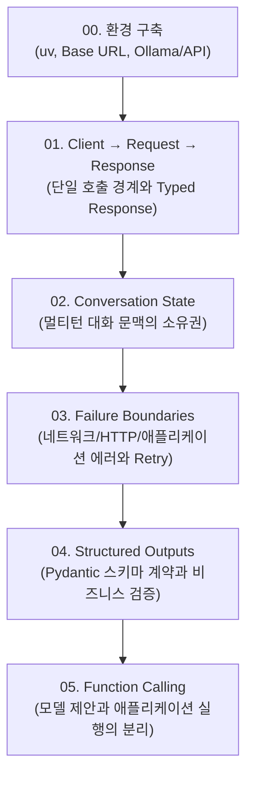

# 0. Introduction: Typed Request/Response Boundary

OpenAI Python SDK를 배우는 과정은 단순히 `client.responses.create(...)`의 매개변수를 외우는 작업이 아니다. 핵심은
**Python application과 언어 모델 API 사이의 경계(Boundary)와 상태(State)의 소유권을 명확히 구분하는 것**이다.

이 교재는 프롬프트 엔지니어링 요령이나 모델의 내부 이론을 다루지 않는다. 대신 application 코드의 관점에서 다음 데이터
흐름을 추적한다.

```text
Python local values
       ↓
Application call arguments
       ↓
SDK serialization & transport
       ↓
[ Network / API Boundary ]
       ↓
External model processing
       ↓
[ Network / API Boundary ]
       ↓
SDK parsing & deserialization
       ↓
Typed Response object
       ↓
Application decision & state
```

---

## 0.1 왜 '경계(Boundary)' 관점인가?

많은 개발자가 LLM 라이브러리를 사용할 때 "SDK가 답을 생성한다"거나 "내가 넘긴 딕셔너리가 그대로 서버로 전송된다"고
착각한다. 이러한 모호한 멘탈 모델은 다음과 같은 실무 문제에 직면했을 때 디버깅을 어렵게 만든다.

- API 키 오류인지, 로컬 인자 오류인지 분리하지 못함
- 네트워크 타임아웃이나 Rate Limit 발생 시 재시도 주체가 누구인지 혼동
- 다중 턴(multi-turn) 대화에서 이전 문맥을 클라이언트와 서버 중 누가 기억하고 있는지 통제 불능
- 모델이 생성한 텍스트를 검증 없이 도메인 로직에 전달하여 런타임 에러 유발
- 도구 호출(Function calling) 시 실제 코드가 어디서 실행되는지 오해

이 deck은 모든 단원에서 **"지금 이 값은 누가 소유하는가?"**와 **"지금 네트워크 경계를 넘었는가?"**라는 두 가지 질문을
던진다.

---

## 0.2 Responses API 중심 학습

OpenAI SDK에는 역사적으로 `client.chat.completions` API가 널리 쓰여왔으나, 최신 baseline은 **Responses
API(`client.responses`)**를 기본 인터페이스로 삼는다.

Responses API는 다음과 같은 아키텍처적 이점을 제공한다:

1. **일관된 Output 구조**: 단순 텍스트뿐만 아니라 추론(reasoning), 메시지(message), 도구 호출(tool call) 등을 일관된
   `output` 아이템 배열로 다룬다.
2. **명확한 상태 식별자**: 응답 리소스 식별자(`response.id`)와 네트워크 추적 식별자(`response._request_id`)를 분리하여
   제공한다.
3. **유연한 대화 문맥**: 클라이언트가 대화 전체를 들고 있는 방식과 서버 측 `previous_response_id` 체이닝을 일관된
   인터페이스로 지원한다.

---

## 0.3 Learning Path (학습 로드맵)

이 deck은 기초 경계부터 복잡한 상태 분리까지 점진적인 5단계 유닛으로 구성되어 있다.



| Unit | 핵심 질문 | 다루는 주제 | 실습 파일 |
| :--- | :--- | :--- | :--- |
| **0. 환경 구축** | 내 실행 환경과 엔드포인트를 어떻게 분리하고 구성하는가? | `uv`, 로컬 Ollama, 공식 API, 환경변수 | [00-environment.md](00-environment.md) |
| **1. Client & Response** | Python 값은 언제 네트워크 요청이 되고 무엇이 돌아오는가? | `OpenAI()` 클라이언트, 인자 구성, `Response` 객체 | [01-client-request-response.md](01-client-request-response.md) |
| **2. Conversation State** | 다음 턴의 대화 문맥(Context)은 누가 소유하는가? | 수동 히스토리 vs `previous_response_id` | [02-conversation-state.md](02-conversation-state.md) |
| **3. Failure Boundaries** | 한 번의 함수 호출 안에서 실제 HTTP 시도는 몇 번 일어나는가? | Connection error, 429/5xx, SDK 재시도와 타임아웃 | [03-failure-boundaries.md](03-failure-boundaries.md) |
| **4. Structured Outputs** | 모델의 응답을 언제 신뢰할 수 있는 데이터로 받아들여도 되는가? | Schema Contract, Pydantic 파싱, Business Validation | [04-structured-outputs.md](04-structured-outputs.md) |
| **5. Function Calling** | 누가 도구 실행을 제안하고 누가 실제 코드를 실행하는가? | Tool definition, Model Proposal, Local Execution | [05-function-calling.md](05-function-calling.md) |

---

## 0.4 증거 기반 학습 원칙 (Evidence Levels)

각 단원의 실습(Playground)은 단순히 화면에 결과 문자열을 띄우는 것이 목적이 아니다. 실습에서 얻은 결과가 어떤 수준의
증거인지 구별해야 한다.

- **Preview**: 네트워크 요청 없이 내 로컬 애플리케이션이 만든 인자(`call_args`)만 검증한다. 비용이 들지 않는다.
- **Synthetic Local HTTP**: 로컬 모의 서버를 통해 제어된 실패(429, 500 등) 상황에서 SDK의 동작을 검증한다.
- **Live Call (Local or Remote)**: 로컬 Ollama 또는 공식 OpenAI API 엔드포인트와 실제로 통신하여 typed response를
  검증한다.
- **Business Validation**: 모델이 스키마에 맞는 JSON을 주었더라도, 그것이 도메인 규칙(예: 유효한 날짜, 양수 금액)을
  만족하는지는 애플리케이션이 별도로 검증한다.

이제 [00-environment.md](00-environment.md)에서 실습에 필요한 실행 환경과 엔드포인트를 구축한다.
